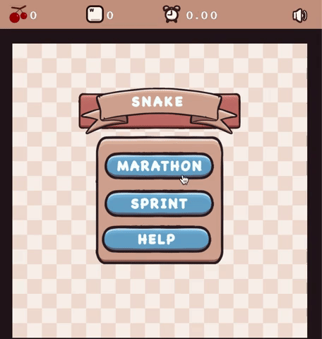

## Classic Snake

### Description

Simple classic snake game.Inspired by video [Learning pygame by creating Snake](https://www.youtube.com/watch?v=QFvqStqPCRU&t=6266s&ab_channel=ClearCode)  

### Features

 - Marathon mode
 - Sprint mode

### Controls

Keyboard:
 - WSAD or arrow keys for snake movement
 - M for Marathon mode
 - S for Sprint mode
 - V for mute/unmute

### Screenshots

### Links

 - itch.io Release: [Classic Snake](https://vivekg13186.itch.io/classic-snake)

### License

### Assets

 - Cool GUI assets from [Handdrawn Vector Icon Pack](https://penzilla.itch.io/handdrawn-vector-icon-pack)
 - Snake logo from [Free Snake Cartoon Pictures](https://charatoon.com/cat/?id=132)
 - Sound from [Crunches](https://opengameart.org/content/7-eating-crunches), [Pop](https://opengameart.org/content/bubbles-pop)